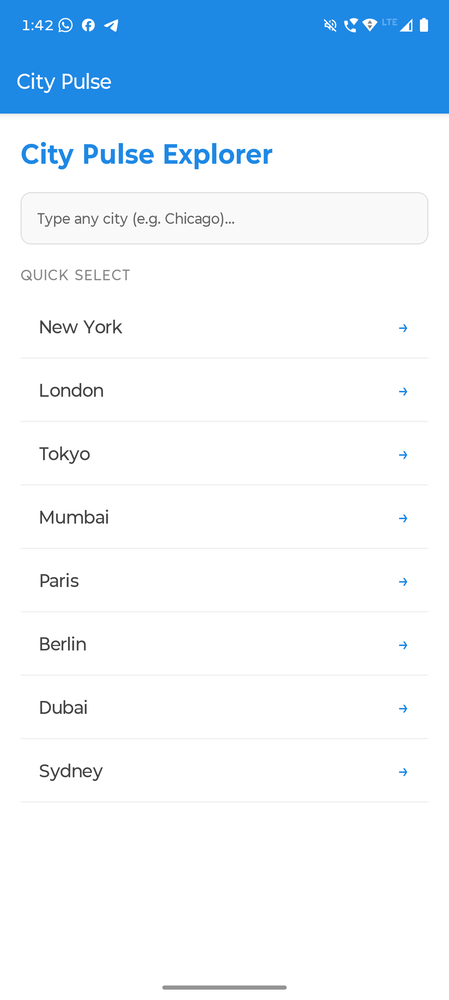
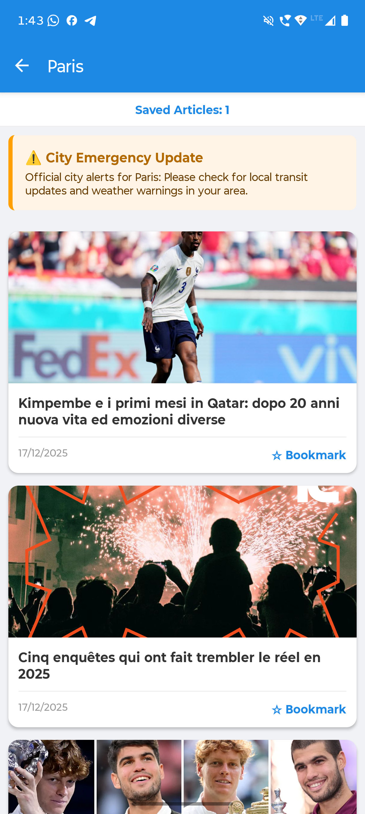
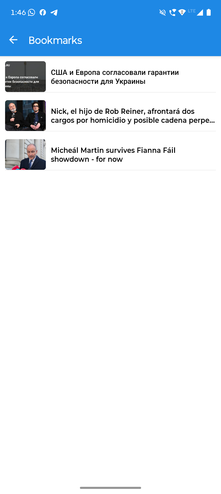

# City Pulse – Smart City News & Alerts

City Pulse is a React Native mobile application built with **Expo** designed to provide real-time, city-specific news and emergency alerts. This project was developed as part of a mid-term assignment to demonstrate proficiency in API integration, state management, and persistent local storage.


##  Key Features (Assignment Checklist)

-  **City-based News**: Dynamically fetches news using the NewsAPI based on user selection or custom search.
-  **WebView Integration**: Full articles are displayed within the app using `react-native-webview`.
-  **Bookmark System**: Users can save articles locally using `AsyncStorage` for offline access to headlines.
-  **Emergency Section**: A dedicated, color-coded alert banner at the top of every feed for critical city notices.
-  **Pull-to-Refresh**: Seamless UX allowing users to update the feed with the latest data manually.


## Screenshots 

 **City Selection**  <br>   <br>
 **News Feed** <br>   <br>
 **WebView**  <br>  | <br>
 **Bookmarks** <br>  <br>


##  Technical Stack

- **Framework**: Expo / React Native
- **Navigation**: React Navigation (Stack)
- **Networking**: Axios for REST API calls
- **Storage**: @react-native-async-storage/async-storage
- **UI Components**: FlatList, RefreshControl, WebView


##  Setup & Installation

1. **Clone the repository:**
   ```bash
   git clone https://github.com/7arj/city-pulse.git
   cd city-pulse

